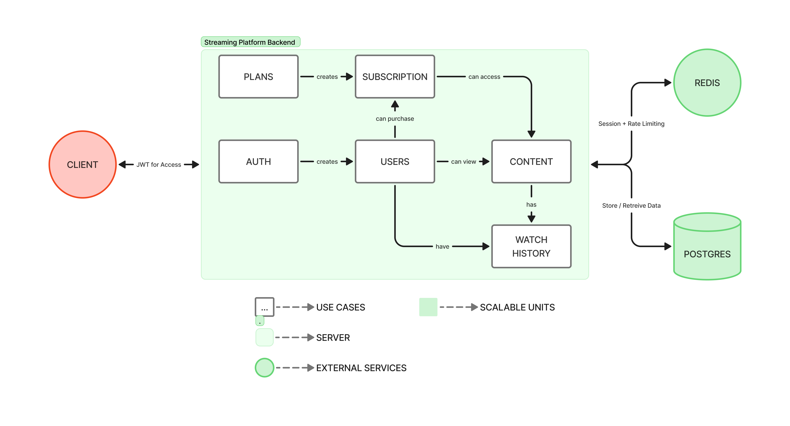

# 📐 Architecture Document

[](https://go.dev/)
[](https://gin-gonic.com/)
[ ](https://redis.io/)
[ ](https://www.postgresql.org/)

## 🚀 Setup Instructions

This guide provides step-by-step instructions for setting up the streaming backend on your local machine.

---

### 1. Prerequisites

- **Go (>=1.20)**
- **PostgreSQL** running and accessible (default: `localhost:5432`)
- **Redis** running and accessible (default: `localhost:6379`)
- **Git**
- **(Optional)** Docker & docker-compose (for containerized local development)

---

### 2. Clone the Repository

```
git clone <your-repo-url>
cd <your-repo-dir>
```

---

### 3. Environment Variables

Copy `.env.example` to `.env` and edit as needed:

```
# Application
PORT=3000
ENVIRONMENT=development
RATE_LIMIT=10

# Database Configuration
DB_HOST=localhost
DB_PORT=5432
DB_USERNAME=rohan
DB_PASSWORD=root
DB_NAME=aub-task
DB_SSL_MODE=disable

# JWT Configuration
JWT_SECRET=your-key-here
JWT_EXPIRATION=1

# Redis Configuration
REDIS_HOST=localhost
REDIS_PORT=6379
REDIS_PASSWORD=root
REDIS_DB=0
```

> Update credentials to match your local database/redis configuration.

---

### 4. Setup Database

- Ensure Postgres is running.
- Create your database (if not exists):

```
CREATE DATABASE streaming_platform;
```

---

### 5. Run Migrations Automatically

The backend auto-runs migrations for all core tables on startup.

---

### 6. Build and Start the Server

```
go run ./cmd/server
```

or for hot-reloading (optional dev):

```
CompileDaemon -build="go build -o app ./cmd/server" -command="./app"
```

---

### 7. Using the API

- Use [Postman API Docs](https://documenter.getpostman.com/view/42882263/2sB3WsQKiE) for examples and testing.
- Or you can use the postman_collection.json `./documents` folder
- The health check endpoint should be available at:

```
curl http://localhost:8080/health
```

---

### 8. Creating Your First Admin User

> **Important:** There is no built-in admin bootstrap. You must create a user via the registration API, then manually set them as admin in the database.

**a. Register via API** (see Postman collection):

```
POST /api/v1/auth/register
{
  "email": "admin@example.com",
  "password": "choose_a_password",
  "name": "Admin User",
  "...": "..."
}
```

**b. Toggle `is_admin` in the database:**

Connect to your database and run:

```
UPDATE users SET is_admin = TRUE WHERE email = 'admin@example.com';
```

or using the user's id:

```
UPDATE users SET is_admin = TRUE WHERE id = '<user-id>';
```

Now your user will have admin privileges and can use endpoints requiring admin status.

---

### 9. Running Unit Tests

```
go test ./tests/unit -v -cover
```

---

### 10. Troubleshooting

- If you get `no Go files in ...`, run `go run ./cmd/server`
- If Redis or Postgres are not running, the app will fail to start.
- Ensure your `.env` matches local service host/ports.

---

## Architecture Explanation

[]()

The architecture of this streaming backend is grounded in Clean Architecture and Domain-Driven Design principles, with a modular separation of domains, usecases, repositories, infrastructure, and interfaces. By designing around a layered architecture using Go and the Gin framework, every component—from core business logic to application orchestration to database adapters—remains isolated and testable. All dependencies are injected dynamically, and domain entities are completely decoupled from infrastructure, making the system easy to extend for future requirements such as new storage engines or authentication methods.

I chose this architecture because it provides long-term stability and flexibility, especially for fast-evolving backend APIs. The separation of concerns ensures that business logic and rules are never polluted by infrastructure code, dramatically reducing bugs and onboarding complexity. Automated unit testing with mocks and contract-first repositories also support rapid iteration and confident refactoring—key factors in building robust, scalable streaming services for production. Overall, this approach balances rapid delivery, security, and maintainability, while staying idiomatic to modern Go enterprise backends.

## Answers To Think Pieces

### What parts of your architecture would you scale independently and how?

Deploy API servers, database, Redis cache, and object storage as separate scalable units using Kubernetes or Docker Swarm. Use horizontal pod autoscalers to add API replicas based on CPU/memory metrics, read replicas for database scaling (writes to master, reads distributed), and separate Redis clusters for sessions, rate-limiting, and caching. This decoupling allows you to scale high-demand components without over-provisioning everything.

### How would you partition or archive watch history and analytical logs at scale?

Use range-based time partitioning (by month/year) in PostgreSQL—query performance stays fast by scanning only relevant partitions. Archive old watch history (>6 months) to cold storage (AWS S3 Glacier) or analytical warehouses (BigQuery, Redshift) via scheduled batch jobs. Implement automatic purging policies to delete data past retention periods, keeping the main database lean. This reduces query latency and storage costs.

### How would you optimize costs for video storage and high data transfer volumes?

Store videos on cloud object storage (S3/GCS) with lifecycle policies to auto-archive to Glacier after 30 days. Use a CDN (CloudFront, Cloudflare, BlazingCDN) to cache content at edge locations, reducing origin bandwidth costs by 35–40%. Implement adaptive bitrate streaming (ABR) to deliver lower resolutions on mobile devices, and leverage volume-based CDN agreements (commit 70% of data upfront for better rates). This combined approach can reduce costs by 25–40%.

### How would you track active sessions efficiently?

Store active session tokens + device info in Redis with auto-expiry; use short-lived JWT tokens (15-min expiry) renewed during playback. Implement periodic heartbeats (every 30–60 seconds) from the client—if no heartbeat, auto-expire the session after grace period. Track concurrent stream counts in Redis per user ID with incrementing/decrementing on play/stop. This prevents ghost sessions and keeps memory efficient.

### How would you enforce concurrent streaming limits per subscription plan (e.g., 2 devices)?

Use Redis counters per user to track active device streams in real-time. When a user attempts to play on a new device, check INCR user:{id}:streams. If count exceeds the plan limit (e.g., 2 for Basic), either block the new request or auto-stop the oldest session (industry standard). Implement DRM license renewal every 10 minutes during playback to re-validate limits. Include device ID + IP address in JWT claims; if mismatched, revoke the token. This is how Netflix, Disney+, and Prime enforce limits.

## AI Tooling Used

- Perplexity
- Cursor
